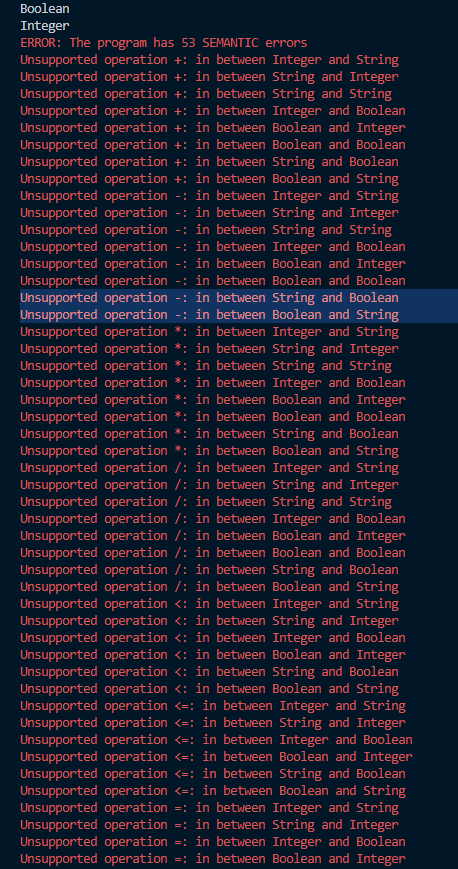

# Compilers Lab 1

ANTLR -> Parser/Lexer -> Tree gui

INDICE

## :cyclone: About

This is a python implementation of ANTLR to read a *.cl file parser and lexer it with ANTLR and then show in screen a tree of the file wiht a specific grammar.

**The document for the semantic types can be found in**[THIS LINK](https://docs.google.com/document/d/1rENcILO97wyMBg6W2bGD8t54zeyllCEIRl2E6ZQi8Rs/edit?usp=sharing)

## :zap: Instalation

You have to follow the official documentation for [ANTLR](https://github.com/antlr/antlr4/blob/master/doc/index.md)

## :electric_plug: Compile

1. Generate the grammar (This will generate the files in dist/grammar) (This is necessary if it is the first time running or if there was a change in the g4)

```python
  antlr4 -Dlanguage=Python3 ./grammar/<FILE_NAME>.g4 -visitor -o yapl/grammar
```

2. Show the tree in the terminal, TOP_RULE in this case will be `program`

``` python
python
  antlr4-parse ./grammar/<FILE_NAME>.g4 <TOP_RULE> -tree
```

## :rocket: Run

``` python
python main.py ./tests/<file_to_test>.cl
```

## :bookmark: Tests

The test for this is "semantic_errors.cl"

SEMANTIC_ERRORS **semantic_errors.cl**



## :star2: Authors

| Raul Angel J. | Donaldo Garcia |
| :---: |:---:|
| [](https://github.com/raulangelj)    | [](https://github.com/donaldosebas) |
| <a href="https://github.com/raulangelj" target="_blank">`@raulangelj`</a> | <a href="https://github.com/donaldosebas" target="_blank">`@donaldosebas`</a> |

## :lock: License

MIT
